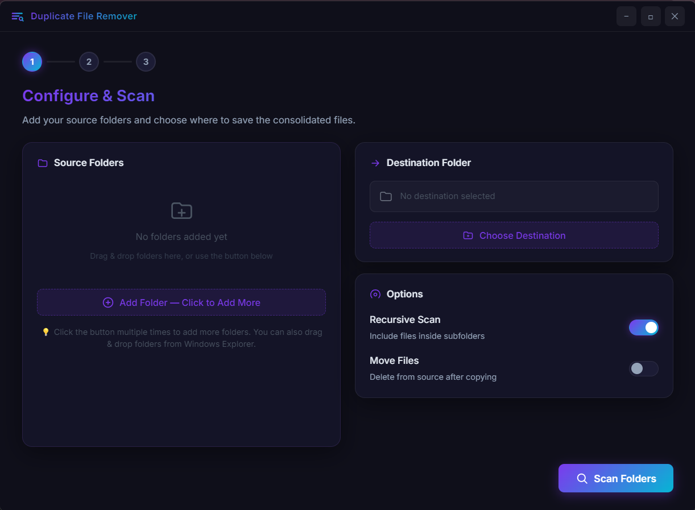
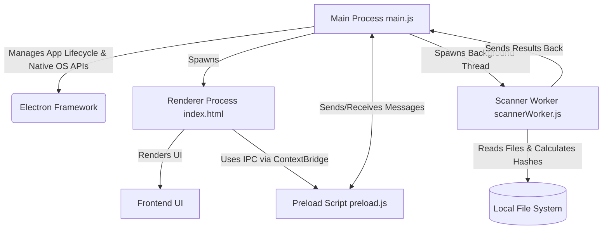

# Duplicate File Remover

A fast, cross-platform desktop utility designed to scan multiple directories, identify exact duplicate files, and help you consolidate unique files while safely removing duplicates to free up storage space.

## 🚀 Features

- **Multi-Folder Scanning**: Select multiple directories at once to scan for duplicates.
- **Accurate Detection**: Identifies exact duplicates based on secure file hashing, guaranteeing accuracy even if file names or extensions differ.
- **Background Processing**: Uses a background worker (Web Worker) to ensure the UI remains responsive during heavy directory scans.
- **User-Friendly Interface**: An intuitive Electron-based graphical user interface (GUI).
- **Safe Review**: Review all identified duplicates before choosing to delete them.
- **Easy Installation**: Packaged natively for Windows (installer and portable versions).

---

## 📸 Screenshots

*(Replace the placeholder below by adding a screenshot of your app named `screenshot.png` inside the `assets/` folder and pushing it to GitHub!)*



---

## 🛠 Tech Stack

The application is built using modern web technologies packaged as a native desktop app:

- **Frontend**: HTML5, CSS3, JavaScript (Vanilla)
- **Backend / Desktop Framework**: [Electron.js](https://www.electronjs.org/)
- **Inter-Process Communication**: Electron IPC (Main Process <-> Preload <-> Renderer)
- **File System Operations**: Node.js `fs` module, Background Workers
- **Packaging & Build**: `electron-builder`

---

## 🏗 Architecture

The application follows the standard Electron multi-process architecture for security and performance:



**Key Components:**
1. **Main Process (`main.js`)**: Controls the application life cycle, native windows, and file system operations. It spawns the background worker for scanning.
2. **Renderer Process (`renderer/`)**: Handles the graphical user interface. Strictly isolated from direct Node.js APIs for security.
3. **Preload Script (`preload.js`)**: Acts as a secure bridge between the Renderer and the Main Process using `contextBridge`.
4. **Scanner Worker (`scannerWorker.js`)**: A background thread that performs the heavy lifting of reading files and calculating hashes, preventing the main UI thread from freezing.

---

## 💻 How to Run (Development)

Follow these steps to run the project locally on your PC.

### Prerequisites
- [Node.js](https://nodejs.org/) (v16+ recommended)
- Git (optional, for cloning)

### Steps

1. **Clone the repository:**
   ```bash
   git clone git@github.com:Ayush-2401/Duplicate-File-Remover.git
   cd Duplicate-File-Remover
   ```

2. **Install dependencies:**
   ```bash
   npm install
   ```

3. **Run the application:**
   ```bash
   npm start
   ```

---

## 📦 How to Build (Production)

To create a standalone executable for Windows (installer and portable `.exe`):

```bash
npm run build
```

This will output the compiled application files in the `dist` folder. You will find both an NSIS setup installer and a portable executable.

---

## 🌟 Advantages of Using This Tool

- **Performance**: By offloading hashing to a background worker, the application handles large volumes of data without crashing or freezing.
- **Accuracy**: Relies on robust hashing algorithms rather than superficial metadata (like names or timestamps) to guarantee that two files are identical.
- **Privacy**: Everything happens locally on your machine. No files or metadata are ever uploaded to a server.
- **Cross-Platform Potential**: While currently configured to build for Windows via `package.json`, the Electron core allows it to be easily ported to macOS and Linux.

---

## 🤝 Contributing

Contributions, issues, and feature requests are welcome! 
Feel free to check the [issues page](https://github.com:Ayush-2401/Duplicate-File-Remover/issues).

## 📝 License

This project is licensed under the MIT License.
